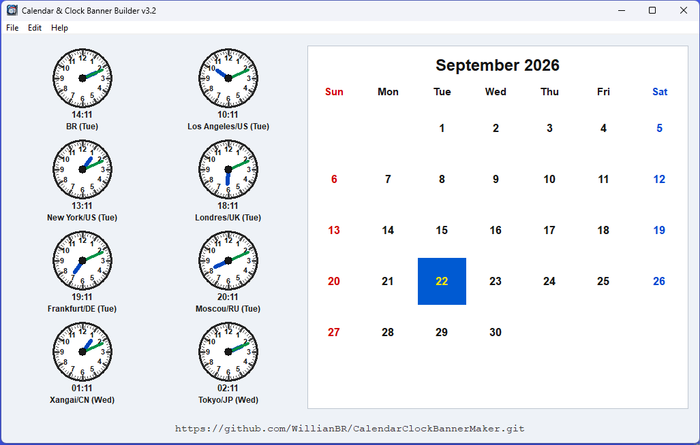

# Calendar & Clock Banner Maker

**CalendarClockBannerMaker** is a native Windows x64 desktop application written
in C using the classic Win32 API.

It combines eight analog/digital world clocks with a calendar, providing a
compact world-time dashboard for people who routinely work across different
countries and time zones.

The application is intentionally lightweight: no framework, no managed runtime,
no Java and no Electron.

---

## Screen layout

The current interface is organized approximately as follows:

```text
+--------------------------------------------------------------------------+
| Calendar & Clock Banner Maker                                            |
+-------------------------------------+------------------------------------+
|                                     |                                    |
|       .--------.       .--------.   |          September 2026            |
|      / 12     1\      / 12     1\  |                                     |
|     | 9   o    3|    | 9   o    3| |   Sun  Mon  Tue  Wed  Thu  Fri  Sat |
|      \    6   /       \    6   /  |          1    2    3    4    5       |
|       '------'         '------'     |    6    7    8    9   10   11   12 |
|        18:17            14:17       |   13   14   15   16   17   18   19 |
|       BR (Mon)         LA_US (Mon)  |   20  [21]  22   23   24   25   26 |
|                                     |   27   28   29   30                |
|       .--------.       .--------.   |                                    |
|      /          \     /          \  |                                    |
|     |     o      |   |     o      | |                                    |
|      \          /     \          /  |                                    |
|       '--------'       '--------'   |                                    |
|        17:17            22:17       |                                    |
|      NY_US (Mon)      LON_UK (Mon)  |                                    |
|                                     |                                    |
|       .--------.       .--------.   |                                    |
|      /          \     /          \  |                                    |
|     |     o      |   |     o      | |                                    |
|      \          /     \          /  |                                    |
|       '--------'       '--------'   |                                    |
|        23:17            00:17       |                                    |
|      FRA_DE (Mon)      MSK_RU (Tue) |                                    |
|                                     |                                    |
|       .--------.       .--------.   |                                    |
|      /          \     /          \  |                                    |
|     |     o      |   |     o      | |                                    |
|      \          /     \          /  |                                    |
|       '--------'       '--------'   |                                    |
|        05:17            06:17       |                                    |
|      SHA_CN (Tue)      TYO_JP (Tue) |                                    |
+-------------------------------------+------------------------------------+
|                             project / information URL                    |
+--------------------------------------------------------------------------+
```

The ASCII diagram is illustrative; the actual window is resizable and its
layout is calculated proportionally.


### Sample image v3.2




---

## Highlights

- Native Win32API x64 application written in C.
- Eight simultaneous world clocks.
- Analog and digital (`HH:MM`) time display.
- All clocks are derived from the same UTC instant.
- Windows time-zone and DST rules are honored.
- Seven clocks are configurable through an INI file.
- Brazilian time is the fixed reference clock.
- Calendar date is always derived from the Brazilian clock.
- English Sunday-first calendar.
- Sunday is displayed in red and Saturday in blue.
- Current Brazilian day is highlighted in blue/yellow.
- Calendar rendering is cached and regenerated only when required.
- PNG export through GDI+ at 96 DPI.
- PNG and `CF_DIB` clipboard support.
- Notification-area (system tray) operation.
- Automatic startup with the current Windows user.
- Single-instance protection.
- Starting the program again restores/shows the existing instance.
- Resizable proportional interface.
- Native executable with no external application runtime.

---

## Default clocks

The default configuration is:

| Position | Label    | City / Region | Windows Time Zone ID             |
|---------:|----------|---------------|----------------------------------|
|        1 | `BR`     | Brasília      | `E. South America Standard Time` |
|        2 | `LA_US`  | Los Angeles   | `Pacific Standard Time`          |
|        3 | `NY_US`  | New York      | `Eastern Standard Time`          |
|        4 | `LON_UK` | London        | `GMT Standard Time`              |
|        5 | `FRA_DE` | Frankfurt     | `W. Europe Standard Time`        |
|        6 | `MSK_RU` | Moscow        | `Russian Standard Time`          |
|        7 | `SHA_CN` | Shanghai      | `China Standard Time`            |
|        8 | `TYO_JP` | Tokyo         | `Tokyo Standard Time`            |

`BR` is intentionally fixed. The remaining seven clocks can be changed without
recompiling the application.

---

## Configuration file

`CalendarClockBannerMaker` uses:

```text
CalendarClockBannerMaker.ini
```

The INI path is derived from the executable path, not from the process current
working directory. This is important when the application is started by a
shortcut or automatically during Windows logon.

If the file does not exist, the application creates it using the default
configuration.

The Brazilian clock (`BR`) is structural and intentionally does not appear in
the configurable clock sections.

### Default INI

```ini
[General]
Version=3.0

[Clock2]
Name=LA_US
TimeZone=Pacific Standard Time

[Clock3]
Name=NY_US
TimeZone=Eastern Standard Time

[Clock4]
Name=LON_UK
TimeZone=GMT Standard Time

[Clock5]
Name=FRA_DE
TimeZone=W. Europe Standard Time

[Clock6]
Name=MSK_RU
TimeZone=Russian Standard Time

[Clock7]
Name=SHA_CN
TimeZone=China Standard Time

[Clock8]
Name=TYO_JP
TimeZone=Tokyo Standard Time
```

### Changing a clock

For example, to replace Frankfurt with Sydney:

```ini
[Clock5]
Name=SYD_AU
TimeZone=AUS Eastern Standard Time
```

Restart `CalendarClockBannerMaker` after editing the INI file.

`Name` is the short label displayed below the clock. `TimeZone` must be a valid
**Windows Time Zone ID**.

An invalid configured time zone is not silently replaced with UTC or the
computer's local time.

### Restoring the defaults

Exit the application and delete or rename:

```text
CalendarClockBannerMaker.ini
```

The default configuration will be created the next time the application starts.

---

## Windows Time Zone reference

The tables below are intended as a convenient operator reference for commonly
used metropolitan areas.

> **Important:** `TimeZone=` expects a Windows Time Zone ID, not an IANA name.
> For example, use `Eastern Standard Time`, not `America/New_York`.
>
> Windows time-zone definitions can change through Windows updates. For the
> authoritative list installed on a particular machine, run:
>
> ```cmd
> tzutil /l
> ```

### South America

| City           | Country   | Suggested Name | Windows Time Zone ID             |
|----------------|-----------|----------------|----------------------------------|
| Brasília       | Brazil    | `BR`           | `E. South America Standard Time` |
| São Paulo      | Brazil    | `SAO_BR`       | `E. South America Standard Time` |
| Rio de Janeiro | Brazil    | `RIO_BR`       | `E. South America Standard Time` |
| Manaus         | Brazil    | `MAO_BR`       | `SA Western Standard Time`       |
| Buenos Aires   | Argentina | `BUE_AR`       | `Argentina Standard Time`        |
| Santiago       | Chile     | `SCL_CL`       | `Pacific SA Standard Time`       |
| Lima           | Peru      | `LIM_PE`       | `SA Pacific Standard Time`       |
| Bogotá         | Colombia  | `BOG_CO`       | `SA Pacific Standard Time`       |
| Quito          | Ecuador   | `UIO_EC`       | `SA Pacific Standard Time`       |
| La Paz         | Bolivia   | `LPB_BO`       | `SA Western Standard Time`       |
| Caracas        | Venezuela | `CCS_VE`       | `Venezuela Standard Time`        |

### North America

| City          | Country       | Suggested Name | Windows Time Zone ID       |
|---------------|---------------|----------------|----------------------------|
| New York      | United States | `NY_US`        | `Eastern Standard Time`    |
| Washington DC | United States | `WAS_US`       | `Eastern Standard Time`    |
| Boston        | United States | `BOS_US`       | `Eastern Standard Time`    |
| Miami         | United States | `MIA_US`       | `Eastern Standard Time`    |
| Chicago       | United States | `CHI_US`       | `Central Standard Time`    |
| Dallas        | United States | `DFW_US`       | `Central Standard Time`    |
| Houston       | United States | `HOU_US`       | `Central Standard Time`    |
| Denver        | United States | `DEN_US`       | `Mountain Standard Time`   |
| Phoenix       | United States | `PHX_US`       | `US Mountain Standard Time` |
| Los Angeles   | United States | `LA_US`        | `Pacific Standard Time`    |
| San Francisco | United States | `SFO_US`       | `Pacific Standard Time`    |
| Seattle       | United States | `SEA_US`       | `Pacific Standard Time`    |
| Toronto       | Canada        | `TOR_CA`       | `Eastern Standard Time`    |
| Montréal      | Canada        | `YUL_CA`       | `Eastern Standard Time`    |
| Vancouver     | Canada        | `YVR_CA`       | `Pacific Standard Time`    |
| Mexico City   | Mexico        | `MEX_MX`       | `Central Standard Time (Mexico)` |

### Europe

| City        | Country        | Suggested Name | Windows Time Zone ID             |
|-------------|----------------|----------------|----------------------------------|
| London      | United Kingdom | `LON_UK`       | `GMT Standard Time`              |
| Dublin      | Ireland        | `DUB_IE`       | `GMT Standard Time`              |
| Lisbon      | Portugal       | `LIS_PT`       | `GMT Standard Time`              |
| Paris       | France         | `PAR_FR`       | `Romance Standard Time`          |
| Madrid      | Spain          | `MAD_ES`       | `Romance Standard Time`          |
| Brussels    | Belgium        | `BRU_BE`       | `Romance Standard Time`          |
| Amsterdam   | Netherlands    | `AMS_NL`       | `W. Europe Standard Time`        |
| Frankfurt   | Germany        | `FRA_DE`       | `W. Europe Standard Time`        |
| Berlin      | Germany        | `BER_DE`       | `W. Europe Standard Time`        |
| Rome        | Italy          | `ROM_IT`       | `W. Europe Standard Time`        |
| Vienna      | Austria        | `VIE_AT`       | `W. Europe Standard Time`        |
| Stockholm   | Sweden         | `STO_SE`       | `W. Europe Standard Time`        |
| Copenhagen  | Denmark        | `CPH_DK`       | `Romance Standard Time`          |
| Oslo        | Norway         | `OSL_NO`       | `W. Europe Standard Time`        |
| Zurich      | Switzerland    | `ZRH_CH`       | `W. Europe Standard Time`        |
| Prague      | Czechia        | `PRG_CZ`       | `Central Europe Standard Time`   |
| Budapest    | Hungary        | `BUD_HU`       | `Central Europe Standard Time`   |
| Warsaw      | Poland         | `WAW_PL`       | `Central European Standard Time` |
| Zagreb      | Croatia        | `ZAG_HR`       | `Central European Standard Time` |
| Athens      | Greece         | `ATH_GR`       | `GTB Standard Time`              |
| Bucharest   | Romania        | `BUH_RO`       | `GTB Standard Time`              |
| Helsinki    | Finland        | `HEL_FI`       | `FLE Standard Time`              |
| Kyiv        | Ukraine        | `KIV_UA`       | `FLE Standard Time`              |
| Istanbul    | Türkiye        | `IST_TR`       | `Turkey Standard Time`           |
| Moscow      | Russia         | `MSK_RU`       | `Russian Standard Time`          |

### Africa

| City         | Country      | Suggested Name | Windows Time Zone ID          |
|--------------|--------------|----------------|-------------------------------|
| Casablanca   | Morocco      | `CAS_MA`       | `Morocco Standard Time`       |
| Algiers      | Algeria      | `ALG_DZ`       | `W. Central Africa Standard Time` |
| Cairo        | Egypt        | `CAI_EG`       | `Egypt Standard Time`         |
| Lagos        | Nigeria      | `LOS_NG`       | `W. Central Africa Standard Time` |
| Johannesburg | South Africa | `JNB_ZA`       | `South Africa Standard Time`  |
| Cape Town    | South Africa | `CPT_ZA`       | `South Africa Standard Time`  |
| Nairobi      | Kenya        | `NBO_KE`       | `E. Africa Standard Time`     |
| Addis Ababa  | Ethiopia     | `ADD_ET`       | `E. Africa Standard Time`     |

### Middle East

| City      | Country              | Suggested Name | Windows Time Zone ID       |
|-----------|----------------------|----------------|----------------------------|
| Jerusalem | Israel               | `JRS_IL`       | `Israel Standard Time`     |
| Beirut    | Lebanon              | `BEY_LB`       | `Middle East Standard Time` |
| Amman     | Jordan               | `AMM_JO`       | `Jordan Standard Time`     |
| Riyadh    | Saudi Arabia         | `RUH_SA`       | `Arab Standard Time`       |
| Doha      | Qatar                | `DOH_QA`       | `Arab Standard Time`       |
| Dubai     | United Arab Emirates | `DXB_AE`       | `Arabian Standard Time`    |
| Abu Dhabi | United Arab Emirates | `AUH_AE`       | `Arabian Standard Time`    |
| Muscat    | Oman                 | `MCT_OM`       | `Arabian Standard Time`    |
| Tehran    | Iran                 | `THR_IR`       | `Iran Standard Time`       |

### South and Central Asia

| City      | Country    | Suggested Name | Windows Time Zone ID        |
|-----------|------------|----------------|-----------------------------|
| Karachi   | Pakistan   | `KHI_PK`       | `Pakistan Standard Time`    |
| Mumbai    | India      | `BOM_IN`       | `India Standard Time`       |
| New Delhi | India      | `DEL_IN`       | `India Standard Time`       |
| Bengaluru | India      | `BLR_IN`       | `India Standard Time`       |
| Kolkata   | India      | `CCU_IN`       | `India Standard Time`       |
| Dhaka     | Bangladesh | `DAC_BD`       | `Bangladesh Standard Time`  |
| Kathmandu | Nepal      | `KTM_NP`       | `Nepal Standard Time`       |
| Tashkent  | Uzbekistan | `TAS_UZ`       | `West Asia Standard Time`   |
| Almaty    | Kazakhstan | `ALA_KZ`       | `Central Asia Standard Time` |

### East and Southeast Asia

| City         | Country     | Suggested Name | Windows Time Zone ID      |
|--------------|-------------|----------------|---------------------------|
| Bangkok      | Thailand    | `BKK_TH`       | `SE Asia Standard Time`   |
| Hanoi        | Vietnam     | `HAN_VN`       | `SE Asia Standard Time`   |
| Jakarta      | Indonesia   | `JKT_ID`       | `SE Asia Standard Time`   |
| Singapore    | Singapore   | `SIN_SG`       | `Singapore Standard Time` |
| Kuala Lumpur | Malaysia    | `KUL_MY`       | `Singapore Standard Time` |
| Manila       | Philippines | `MNL_PH`       | `Singapore Standard Time` |
| Beijing      | China       | `BJS_CN`       | `China Standard Time`     |
| Shanghai     | China       | `SHA_CN`       | `China Standard Time`     |
| Hong Kong    | Hong Kong   | `HKG_HK`       | `China Standard Time`     |
| Taipei       | Taiwan      | `TPE_TW`       | `Taipei Standard Time`    |
| Seoul        | South Korea | `SEL_KR`       | `Korea Standard Time`     |
| Tokyo        | Japan       | `TYO_JP`       | `Tokyo Standard Time`     |
| Osaka        | Japan       | `OSA_JP`       | `Tokyo Standard Time`     |

### Oceania

| City       | Country     | Suggested Name | Windows Time Zone ID          |
|------------|-------------|----------------|-------------------------------|
| Perth      | Australia   | `PER_AU`       | `W. Australia Standard Time`  |
| Adelaide   | Australia   | `ADL_AU`       | `Cen. Australia Standard Time` |
| Melbourne  | Australia   | `MEL_AU`       | `AUS Eastern Standard Time`   |
| Sydney     | Australia   | `SYD_AU`       | `AUS Eastern Standard Time`   |
| Brisbane   | Australia   | `BNE_AU`       | `E. Australia Standard Time`  |
| Auckland   | New Zealand | `AKL_NZ`       | `New Zealand Standard Time`   |
| Wellington | New Zealand | `WLG_NZ`       | `New Zealand Standard Time`   |

---

## Calendar

The calendar is deliberately tied to the Brazilian (`BR`) clock rather than
to the Windows local time-zone configuration.

Changing the computer's configured local time zone therefore does not change
the reference date used by `CalendarClockBannerMaker`.

The calendar:

- starts the week on Sunday;
- displays Sunday in red;
- displays Saturday in blue;
- highlights the current Brazilian date;
- uses English abbreviated weekday names;
- caches its rendered image and regenerates it only when necessary.

---

## Window and system tray

Closing the main window with the **X** button hides `CalendarClockBannerMaker`
in the Windows notification area instead of terminating it.

Use:

```text
File > Exit
```

or the notification-area **Exit** command to terminate the application.

The application is single-instance. If its executable is started while another
copy is already running, the new process detects the existing instance,
restores/shows its window and exits.

---

## Automatic startup

`CalendarClockBannerMaker` creates a shortcut in the current user's Windows
Startup folder.

The shortcut points to the application executable, allowing the world-time
panel to be available automatically after Windows logon.

---

## Exporting the banner

### Save as PNG

Use:

```text
File > Save
```

or:

```text
Ctrl+S
```

The rendered canvas is exported as PNG using GDI+ at 96 DPI.

### Copy to Clipboard

Use:

```text
Edit > Copy
```

or:

```text
Ctrl+C
```

The application publishes the rendered image to the Windows Clipboard in PNG
format and also provides `CF_DIB` compatibility.

---

## Building

### Requirements

- Windows 10/11 x64
- GCC 10 / MinGW-w64 / TDM-GCC
- GNU Make
- GNU Binutils (`objcopy`, `strip`)
- AStyle
- `sha256sum`
- Info-ZIP `zip`

### DEBUG

```cmd
make DEBUG
```

### RELEASE

```cmd
make RELEASE
```

Artifacts are written below:

```text
build/DEBUG
build/RELEASE
```

Debug information is extracted into an external `.dbg` file. The executable
contains a `.gnu_debuglink` reference to the corresponding symbol file.

A RELEASE build also creates the SHA-256 manifest and distribution ZIP.

The RELEASE ZIP is flat: build-directory paths are not stored inside it.

```text
CalendarClockBannerMaker.exe
CalendarClockBannerMaker_<git-commit>.dbg
CalendarClockBannerMaker.sha256
```

The debug-symbol filename may also contain the `-dirty` suffix when the source
tree contains uncommitted changes.

---

## Source formatting

C source files are automatically formatted during the build using AStyle.

Current formatting policy:

```text
--style=allman --indent=spaces=4 --suffix=none
```

---

## Application icon

The application includes a multi-resolution Windows icon:

```text
 16 x 16
 24 x 24
 32 x 32
 48 x 48
 64 x 64
128 x 128
256 x 256
```

Its artwork combines the three central concepts of the project:

- world time;
- calendar;
- clocks.

A high-resolution PNG version is also suitable for repository documentation,
release pages and other project material.

---

## Design principles

`CalendarClockBannerMaker` deliberately uses the classic Windows API and C.

The project favors:

- small native executables;
- minimal dependencies;
- predictable resource usage;
- compatibility with traditional Windows development tools;
- explicit and human-readable configuration;
- operator-friendly behavior.

**No Electron. No Java. No browser pretending to be a desktop application. :-)**

---

## Future ideas

Possible future versions may include:

- graphical clock configuration;
- Windows time-zone selection dialog;
- drag-and-drop clock ordering;
- additional clock layouts;
- live INI reload;
- configurable visual themes.

Until then, the INI file provides a simple, transparent and easily editable
way to customize the world-time panel.
